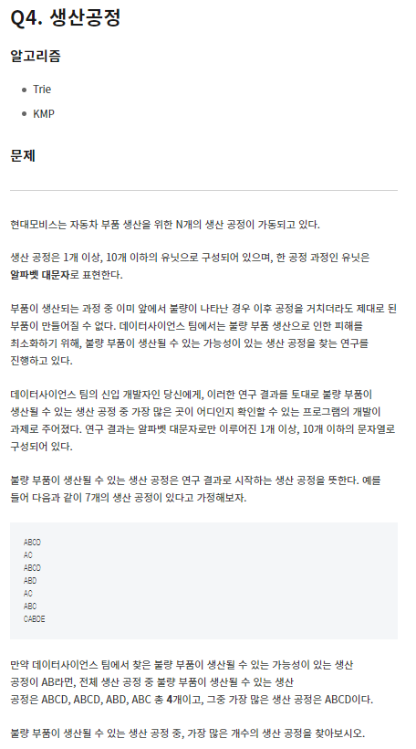

원래 문제는 Trie 알고리즘을 요구하는 문제였지만, 파이썬의 실행 시간이 10초여서 가능한 모든 경우의 수를 만들어 두어도 시간초과가 안될 것으로 판단하여 가능한 모든 조건을 탐색하고 저장하여 풀이 함

```python
import sys

def input():
	return sys.stdin.readline().rstrip()

N = int(input())

# 생산 공정의 등장 횟수 저장 딕셔너리
oper_dict = {}

for _ in range(N):
	op = input()
	if oper_dict.get(op):
		oper_dict[op] += 1
	else:
		oper_dict[op] = 1

# 불량 부품 생성이 가능한 공정의 최대 갯수와 전체 공정 저장 딕셔너리
ans_dict = {}

for key, v in oper_dict.items():

	# 전체 공정 길이
	l = len(key)

	# 전체 공정부터 맨뒤 하나씩 제거하면서 반복
	for i in range(l):
		k = key[:l-i]

		# 해당 공정의 최대 횟수 갱신
		if ans_dict.get(k):
			if v > ans_dict[k][1]:
				ans_dict[k] = [key, v]

			# 만약 갯수 동일 시 사전 순으로 갱신
			elif v == ans_dict[k][1] and ans_dict[k][0] > key:
				ans_dict[k] = [key, v]
		else:
			ans_dict[k] = [key, v]


K = int(input())
for _ in range(K):
	op = input()
	# 불량 생성 가능한 공정의 전체 공정과 갯수 출력, 없으면 0 출력
	if ans_dict.get(op):
		print(*ans_dict[op])
	else:
		print(0)
```
